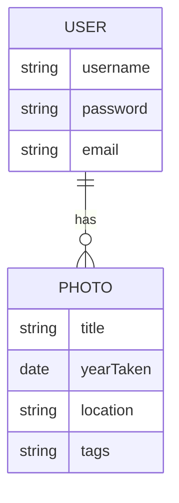

# Photography Portfolio Backend
- **Description**: This is an API/Backend system using MongoDB to store information that will allow the user to view any photographs in the database. The user will also be able to update their list of favorite photos with full CRUD functionality.

### Technologies Used
- Express
- Javascript
- MongoDB
- Mongoose
- Dotenv 
- CORS 
- Morgan

### Models

### Backend Route Table
| Route Name |     URL    | HTTP Verb |        Description        |
|------------|------------|-----------|---------------------------|
|   Index    | /photo     |    GET    | Display list of photos    |
|   Show     | /photo/:id |    GET    | Shows a specific photo    |
|   Create   | /photo     |    POST   | Add new photo to database |
|   Update   | /photo/:id |    PUT    | Update a specific photo   |
|   Delete   | /photo/:id |   DELETE  | Delete a specific photo   |

### API
[Deployed Backend Link](https://photography-portfolio.herokuapp.com/)

### User Stories
- As a user, I can see a list of all the photos when I visit the page
- As a user, I can see detailed information about a specific photo
- As a user, I can create a new photo and add to the database
- As a user, I can update any specific photo if any information were to change
- As a user, I can delete any specific photo that I may need removed